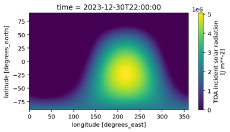
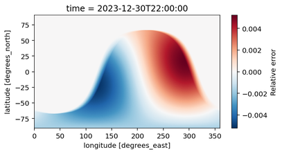

# JAX Solar: Top of atmosphere incident solar radiation, in JAX.

Authors: Peter Norgaard and Stephan Hoyer

JAX Solar is a JAX implementation of top of atmosphere incident solar
radiation (TISR), for use in weather and climate models. It was originally
written for [NeuralGCM](https://github.com/neuralgcm/neuralgcm).

This code uses simple formulas inspired by pysolar, but unlike pysolar it
does not include atmospheric scattering effects. Of particular note, the
constants used to compute solar irradiance are different.

## Typical usage

```python
import jax_solar
import jax_datetime as jdt

# near sunset in San Francisco
time = jdt.to_datetime('2024-12-28T00:30')
lat = 37.7749
lon = -122.4194
relative_flux = jax_solar.normalized_radiation_flux(time, lon, lat)
print(relative_flux)  # Array(0.07284241, dtype=float32, weak_type=True)
```

## How accurate is it?

JAX Solar is accurate to within about 0.5% of TISR values in ERA5:

```python
import xarray
import jax_solar
import jax_datetime as jdt

time = '20231230T22'

ds = xarray.open_zarr(
    'gs://gcp-public-data-arco-era5/ar/full_37-1h-0p25deg-chunk-1.zarr-v3',
    chunks=None,
    storage_options=dict(token='anon'),
)
tisr_era5 = ds.toa_incident_solar_radiation.sel(time=time).compute()

# TISR in ERA5 is integrated over the previous hour, whereas JAX Solar
# provides instantaneous values.
lats, lons = xarray.broadcast(tisr_era5.latitude, tisr_era5.longitude)
dt = 5*60  # in seconds
times = jdt.to_datetime(time) - jnp.arange(0, 60*60//dt + 1) * jdt.Timedelta(seconds=dt)
flux = jnp.trapezoid(
    jax.vmap(lambda t: jax_solar.radiation_flux(t, lons.data, lats.data))(times),
    axis=0,
    dx=dt,
)
tisr_jax_solar = tisr_era5.copy(data=flux)

# first plot: reference TISR from ERA5
tisr_era5.plot(size=3, aspect=2)

# second plot: relative error
relative_error = (tisr_jax_solar - tisr_era5) / tisr_era5.max()
relative_error.rename('Relative error').plot(size=3, aspect=2)
```





If 0.5% accuracy is not good enough for you, you could consider using the
[solar radiation code](https://github.com/google-deepmind/graphcast/blob/6819a0f19796ca9c34a079855339b37134b8d930/graphcast/solar_radiation.py)
from GraphCast, which nearly exactly matches ERA5.
